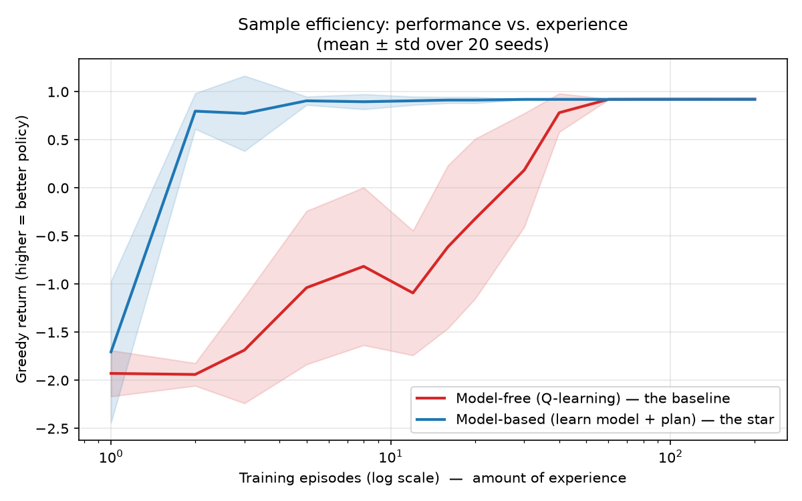
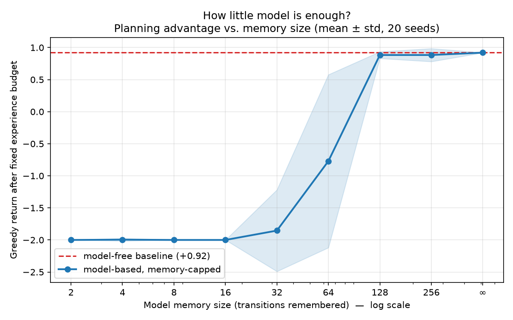

# sid-efficient-agents

**Study: how little world-model does an agent need before planning beats trial-and-error?**

An agent dropped into an unfamiliar world can *react* (learn, per situation,
which actions felt good) or *understand* (build a model of how the world works
and plan on it). This repo reproduces, cleanly, seed-averaged and honestly
reported, two well known facts in a small stochastic gridworld and adds one
small empirical characterization of my own:

1. **Model-based learning is more sample-efficient.** An agent that learns a
   model and plans reaches a good policy in ~an order of magnitude fewer
   episodes than model-free Q-learning.
2. **You don't need a complete model.** Starving the learned model to only its
   most recent *N* transitions, performance is useless below ~32 remembered
   transitions and fully recovered by ~128, most of the map turns out to be
   unnecessary.

> See [`PAPER.md`](PAPER.md) for the full writeup,
> including limitations and an honest caveat about what each figure does and
> does not show.

---

## Results

**Sample efficiency - the model-based agent learns from far less experience:**



**How little model is enough - a sharp threshold around ~128 transitions:**



---

## The setup, briefly

- **Environment:** 5x5 gridworld, 21 reachable states, 10% slip probability,
  `+1` at goal / `-0.01` per step, `gamma = 0.95`. The environment never reveals
  its rules; agents see only `(state, action, reward, next_state)`.
- **Baseline (model-free):** tabular Q-learning.
- **Star (model-based):** estimates transitions and rewards by counting, then
  plans with value iteration - the textbook Bellman backup, run on a *learned*
  model instead of a given one.
- **Rigor:** greedy evaluation with learning/exploration frozen; every number
  averaged over 20 random seeds with spread reported.

---

## Run it

```bash
python -m venv venv && source venv/bin/activate    # Windows: venv\Scripts\activate
pip install numpy matplotlib

python -m experiments.compare          # -> results/sample_efficiency.png
python -m experiments.memory_sweep     # -> results/memory_sweep.png
```

---

## Layout

```
gridworld/      the environment (the MDP, made executable)
agents/         q_learning.py (baseline), model_based.py (star),
                starved_model_based.py (memory-capped, for experiment 2)
experiments/    compare.py (sample efficiency), memory_sweep.py (how little model)
results/        generated figures
PAPER.md        the full, honest writeup
```

---

*Built as a end-to-end research under [SID Machines](https://github.com/sidmachines). The goal was to earn the machinery, define a question, run a fair experiment and to measure across seeds*
